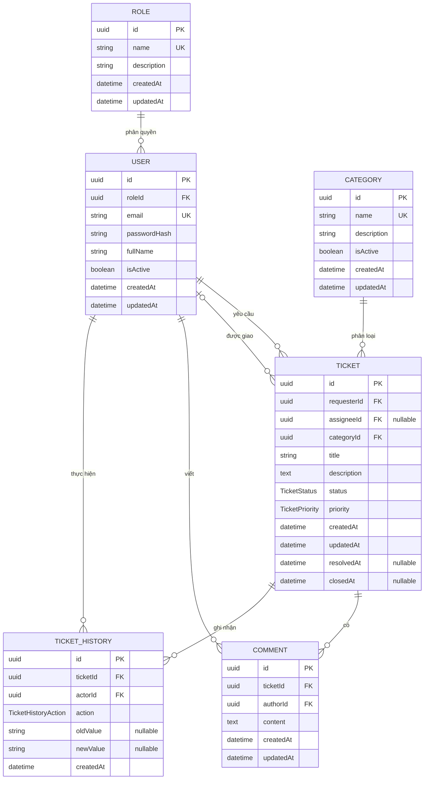

# ERD v0.1 · IT-002

> Trạng thái: **Đã được Kiên duyệt ngày 12/08/2026**.

## Sơ đồ quan hệ



## Enum

### `TicketStatus`

```text
OPEN
IN_PROGRESS
RESOLVED
CLOSED
```

Luồng mặc định: `OPEN -> IN_PROGRESS -> RESOLVED -> CLOSED`.

- Ticket mới mặc định là `OPEN`.
- Chỉ `STAFF` hoặc `ADMIN` được chuyển ticket sang `IN_PROGRESS` hoặc `RESOLVED`.
- Việc mở lại ticket `CLOSED` chưa được cho phép trong v0.1; nhóm sẽ chốt trước Sprint 2.

### `TicketPriority`

```text
LOW
MEDIUM
HIGH
URGENT
```

Mặc định là `MEDIUM`. Student có thể đề xuất; Staff/Admin có thể điều chỉnh.

### `TicketHistoryAction`

```text
STATUS_CHANGED
ASSIGNEE_CHANGED
PRIORITY_CHANGED
CATEGORY_CHANGED
```

Hai action bắt buộc phải ghi lịch sử trong v0.1 là `STATUS_CHANGED` và
`ASSIGNEE_CHANGED`. Hai action còn lại được định nghĩa sẵn để audit nhất quán khi
Staff/Admin điều chỉnh ticket.

Tên role là dữ liệu trong bảng `Role`, không phải enum PostgreSQL. Dữ liệu khởi tạo:
`STUDENT`, `STAFF`, `ADMIN`. Cách này giữ `Role` là một entity đúng theo yêu cầu và
cho phép bổ sung role mà không phải đổi enum/migration.

## Khóa ngoại và quy tắc xóa

| Bảng/cột | Tham chiếu | Khi xóa bản ghi cha | Lý do |
|---|---|---|---|
| `User.roleId` | `Role.id` | `RESTRICT` | Không xóa role đang được sử dụng |
| `Ticket.requesterId` | `User.id` | `RESTRICT` | Giữ chủ thể tạo ticket |
| `Ticket.assigneeId` | `User.id` | `SET NULL` | Ticket có thể quay về trạng thái chưa được giao |
| `Ticket.categoryId` | `Category.id` | `RESTRICT` | Không làm ticket mất phân loại |
| `Comment.ticketId` | `Ticket.id` | `CASCADE` | Comment thuộc vòng đời ticket |
| `Comment.authorId` | `User.id` | `RESTRICT` | Giữ tác giả comment |
| `TicketHistory.ticketId` | `Ticket.id` | `CASCADE` | History thuộc vòng đời ticket |
| `TicketHistory.actorId` | `User.id` | `RESTRICT` | Giữ người thực hiện thay đổi |

Không hard-delete `User`, `Category` hoặc `Ticket` trong luồng nghiệp vụ thông
thường. `User` và `Category` dùng `isActive`; ticket được kết thúc bằng trạng thái
`CLOSED`. Các quy tắc xóa ở trên là hàng rào toàn vẹn dữ liệu ở cấp database.

## Cardinality và ràng buộc

- Một `Role` có nhiều `User`; mỗi `User` có đúng một `Role`.
- Một `User` có thể tạo nhiều `Ticket`; mỗi ticket có đúng một requester.
- Một `User` có thể được giao nhiều ticket; mỗi ticket có tối đa một assignee.
- Một `Category` có nhiều ticket; mỗi ticket thuộc đúng một category.
- Một ticket có nhiều comment/history; mỗi comment/history thuộc đúng một ticket.
- `Role.name`, `User.email` và `Category.name` là duy nhất.
- Tạo index cho các cột FK và các trường lọc ticket thường dùng:
  `status`, `priority`, `createdAt`.
- `TicketHistory.oldValue/newValue` lưu giá trị dạng chuỗi. Với thay đổi assignee,
  giá trị là UUID user; với thay đổi status/priority/category, giá trị là enum hoặc
  UUID category tương ứng. API chịu trách nhiệm ghi history trong cùng transaction
  với lần cập nhật ticket.

## Các điểm đã duyệt trước migration

1. Mỗi user có đúng một role ở Sprint 1.
2. Mỗi ticket có một category và tối đa một assignee.
3. Role được lưu bằng bảng dữ liệu; ba role mặc định được seed.
4. Chấp nhận bốn enum và luồng trạng thái nêu trên.
5. Chấp nhận quy tắc khóa ngoại/xóa và chính sách không hard-delete.
6. Việc mở lại ticket `CLOSED` để lại cho quyết định Sprint 2.

Các điểm trên đã được Kiên duyệt cho migration PostgreSQL đầu tiên.
